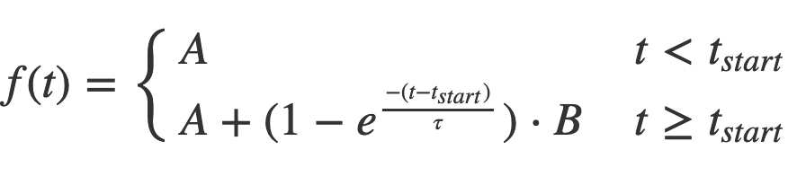
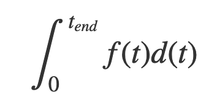

# Bioxydyn Tech Test

## Introduction

Welcome to Bioxydyn's technical test! The purpose of this test is to assess your ability to write clean code that implements a brief as specified. The test can be completed using either the Javascript or python programming language, and should take you around 1 hour.

## Instructions

Clone this repository and modify the file `Javascript/equation.js` _or_ `Python/equation.py` (depending on your language preference) to implement the brief below. When you are finished, zip the tech-test folder and email to matthew.heaton@bioxydyn.com. Alternatively, you may work in a private github repository and share your repository with `mj-heaton` & `schofield-r`.

If you require any further information or encounter any issues in completing this test, please contact matthew.heaton@bioxydyn.com.

Please *do not* make the source code of your completed test public.

## The Brief

### Part 1 - The Wash In Equation

Complete the function `washInEquation` in `equation.js` or `equation.py` so that it implements following equation with the following parameter values:

*where:*

_tstart_ = 10.0

_A_ = 1.0

_B_ = 5.0

_τ_ = 12.0

### Part 2 - Integrating The Wash In Equation

Complete the function `areaUnderWashInEquation` in `equation.js` or `equation.py` so that it implements the equation below. This function should therefore evaluate the area under the first equation between the time points of 0.0 and _tend_. You may use any algorithm you wish to do this, but please don't make use of a third-party library.

## Testing your code

Please run the provided tests to check your code before submitting it.

### JavaScript

    node Javascript/test

*note: with node assertions you will only get a message if the tests have failed*

### Python 

Install pytest

    $ pip3 install pytest

Then run 

    $ pytest Python/test.py
